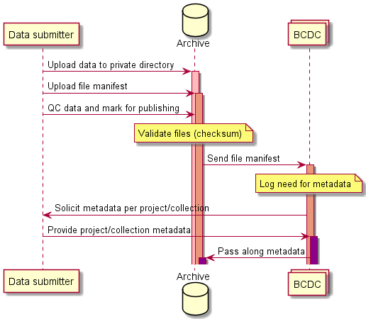

The workflow diagram above was produced using PlantUML (download [plantuml.jar here](https://plantuml.com/download)).

To edit the diagram, change the PlantUML code below and run the following at the command line: `java -jar plantuml.jar -verbose README.md -o images`

```
@startuml

participant "Data submitter"
database "Archive"
collections "BCDC"

"Data submitter" -> "Archive": Upload data to private directory
activate "Archive" #FFBBBB

"Data submitter" -> "Archive": Upload file manifest
activate "Archive" #DarkSalmon

"Data submitter" -> "Archive": QC data and mark for publishing

note over "Archive": Validate files (checksum)

"Archive" -> "BCDC": Send file manifest
activate "BCDC" #DarkSalmon

note over "BCDC": Log need for metadata
"BCDC" -> "Data submitter": Solicit metadata per project/collection

"Data submitter" -> "BCDC": Provide project/collection metadata
activate "BCDC" #DarkMagenta

"BCDC" -> "Archive": Pass along metadata
activate "Archive" #DarkMagenta

@enduml
```